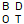

# BDOT10k 

Wtyczka umożliwiająca pobieranie danych BDOT10k z poziomu QGISa.

Plugin for downloading BDOT10k data (Database of Topographic Objects) directly from QGIS.

- zaznaczając pola wyboru dla poszczególnych powiatów pogrupowanych województwami
- by selecting checkboxes for individual counties grouped by voivodeships

- poprzez selekcję powiatów na podstawie przecięcia z wybraną warstwą wektorową
- by selecting counties based on the intersection with the chosen vector layer

