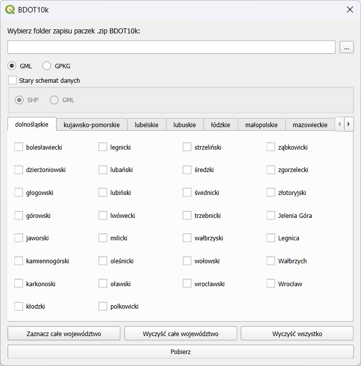
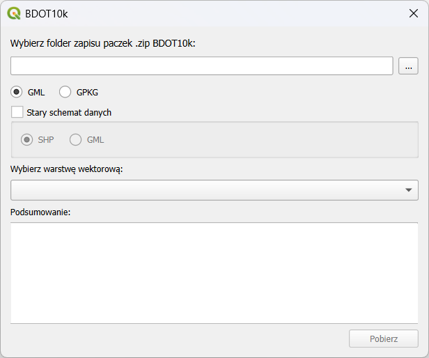

# BDOT10k

Wtyczka umożliwiająca pobieranie danych BDOT10k z poziomu QGISa.

Plugin for downloading BDOT10k data (Topographic Objects Database) directly within QGIS.

- zaznaczając pola wyboru dla poszczególnych powiatów pogrupowanych województwami
- by selecting individual counties using checkboxes, grouped by voivodeships

- poprzez selekcję powiatów na podstawie przecięcia z wybraną warstwą wektorową
- by selecting counties based on their intersection	with a chosen vector layer

